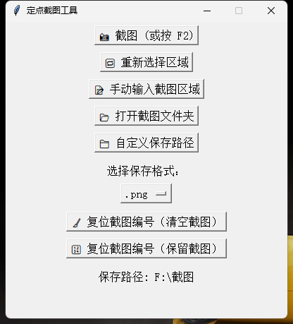

# ScreenshotTool 定点截图助手


> 一个简洁实用的定点截图工具，支持快捷键截图、手动选区、自定义保存路径等功能，适合办公与开发场景使用。

---

## 🧰 功能特点

- 📸 **快捷键截图**：按下 F2 即可快速截图
- 🖱 **鼠标可视化选区**：通过拖拽选定截图区域
- 📝 **手动输入区域**：支持自定义截图宽高与位置
- 📁 **自定义保存路径**：截图可保存至任意位置
- 🔢 **截图自动编号**：文件名自动编号，便于整理
- 🌐 **多格式支持**：支持 PNG 与 JPG 格式选择
- ♻️ **编号重置与清空**：支持一键清除旧图或仅重置编号

---

## 📦 安装与运行

### 方法一：使用打包好的 EXE 文件
1. 下载 release 中的 `ScreenshotTool.exe`
2. 双击运行即可使用，无需安装 Python

### 方法二：运行 Python 源代码
```bash
pip install pillow keyboard pygetwindow
python ScreenshotTool.py
```

---

## 🖼 主界面展示

> 👉 以下是工具主界面截图示意（请自行替换为真实截图）



---

## 🧑‍💻 开发者

**Author**: [你的GitHub用户名]  
**项目地址**: [https://github.com/你的项目地址]  

欢迎 star、fork、提 issue 或提交 PR！

---

## 📋 License

本项目遵循 MIT 开源许可证。

